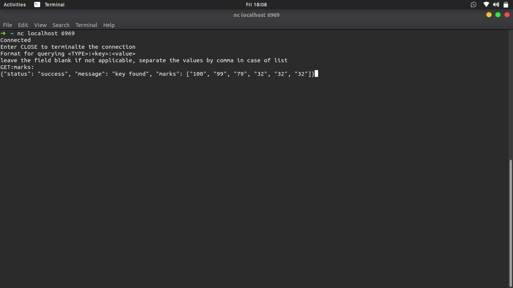
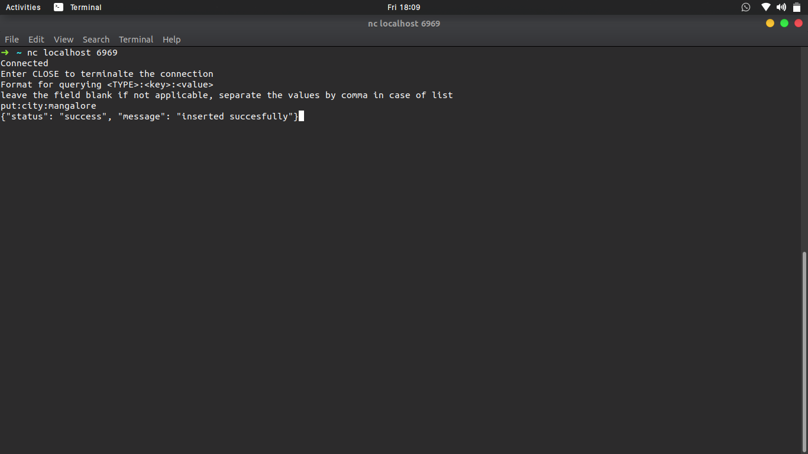

# NoSqlDb
A simple Nosql database implemented using python. 

<b> Usage:</b>  
run the db.py file by using command: `python3 db.py`  
Then create a socket connection to the specified port with any program to start querying 
Linux users can use netcat by running commnad: `nc localhost <portno>`
 
<b>Examples:</b> 
 

 

